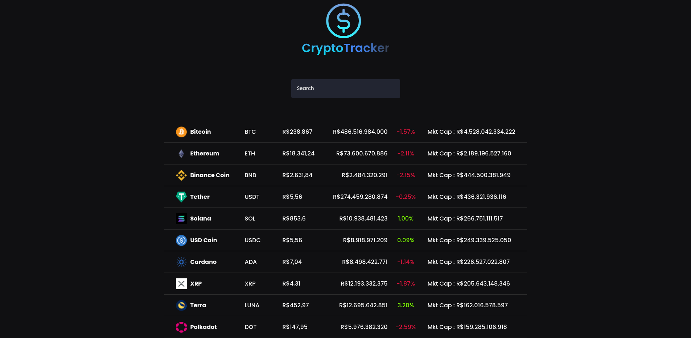
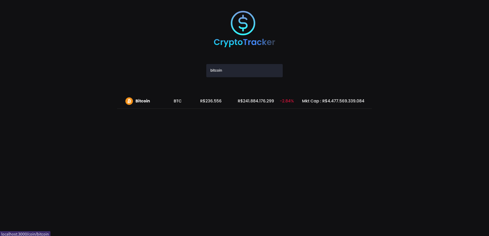
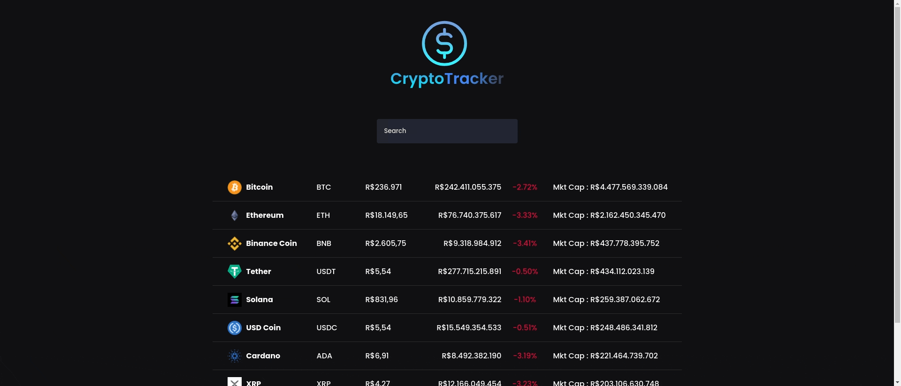
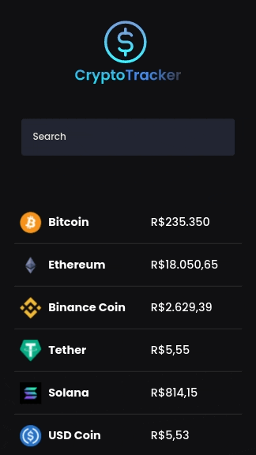

# Trackeador de Criptomoedas

Um trackeador de preços das criptomoedas utilizando React, NextJS.

## Tela Inicial Web

## Tela Inicial Mobile

O site está hospedado na vercel você pode acessa-lo por este link https://cep-gamma.vercel.app/

## Stack utilizada

**Front-end:** ReactJs,NextJS Css e HTML5

**Misc:** Consumo de API e Conventional Commits

## Aprendizados

- Uso do NextJs para facilitar navegação de paginas
- Uso do Hook UseState do React
- Consumo da API do coingecko
- Conventional Commits para facilitar a leitura de commits

## Como usar

Para iniciar a busca digite uma criptomoeda no campo de busca

Então o site ira fazer a busca da criptomoeda informada

Atenção atualmente o site possui apenas as 10 moedas mais revelantes.

## Mobile

A versão mobile está toda responsiva e o uso é o mesmo da versão desktop
